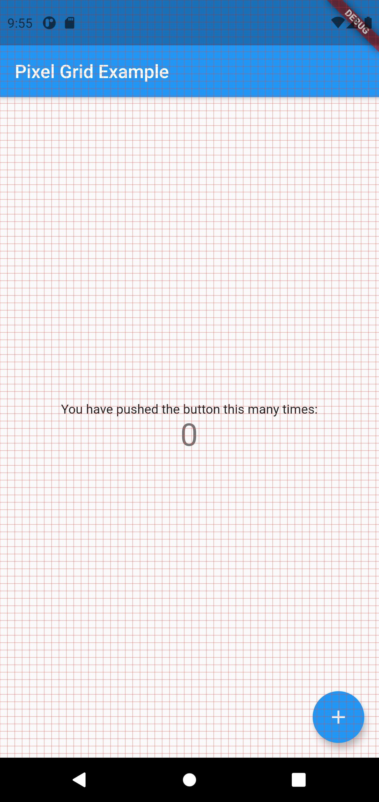
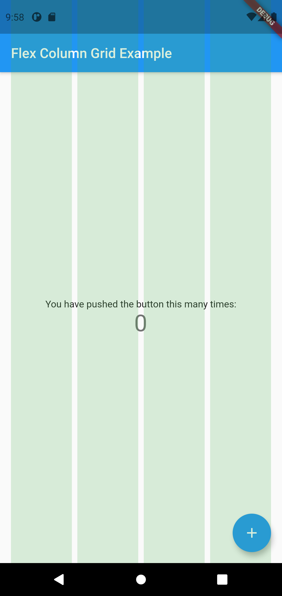
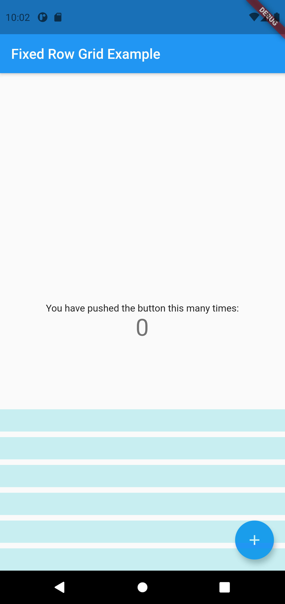

# layout_grids

`layout_grids` is a Dart/Flutter package that makes it easy to overlay several types of grids on your UI, to make sure that it lines up nicely with your design's grid system.

## Installation

To use this plugin in your project, add `layout_grids` as a dependency in your pubspec.yaml file.

## Usage

Wrap the UI that should conform to your grid system with a `GridOverlay`. This widget takes a list of `grids` and an optional `enabled` parameter, which defaults to `true`.

## Supported Grid Types

This package supports various layout grids that can be visualized in UI/UX tools like Figma and Adobe XD.

### Pixel Grids

Simple square grids with a fixed cell size.

* `PixelGrid`

Example:
```dart
GridOverlay(
    grids: [
        PixelGrid(
            cellSize: 8.0,
            color: Colors.red.withOpacity(0.8),
        ),
    ],
    child: CounterApp(),
);
```


### Flex Grids
Flex grids are composed of flexible bands (rows or columns) with a fixed count, gutter size, and margin size. After allocating space for the margins and gutters, the bands expand to fill the remaining space.

* `FlexRowGrid`
* `FlexColumnGrid`

Example:
```dart
GridOverlay(
    grids: [
        FlexColumnGrid(
          count: 4,
          gutter: 8,
          margin: 16,
          color: Colors.green.withOpacity(0.2),
        ),
    ],
    child: CounterApp(),
);
```


### Fixed Band Grids
A grid of bands (rows or columns) with a fixed size, count, and gutter size. An alignment and offset can optionally be specified, but the grid positioning defaults to centered.

* `FixedRowGrid`
* `FixedColumnGrid`

Example:
```dart
GridOverlay(
    grids: [
        FixedRowGrid(
            count: 6,
            height: 32,
            gutter: 8,
            alignment: GridAlignment.end,
            color: Colors.cyan.withOpacity(0.2),
        ),
    ],
    child: CounterApp(),
);
```



## Example

See the `example` folder for a simple app that combines several grids into a single overlay.

## Contributing
Pull requests are welcome. For major changes, please open an issue first to discuss what you would like to change.

Please make sure to update tests as appropriate.

## License
[MIT](https://choosealicense.com/licenses/mit/)